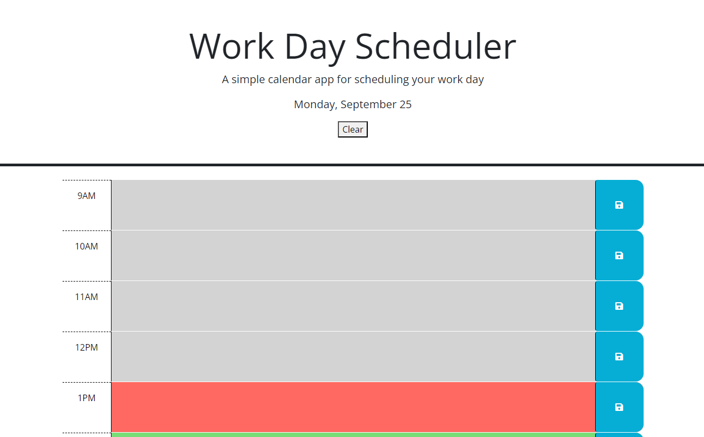

# Week 5 Homework - Work Day Scheduler

## Description

This website was created as a homework assignment for the University of Richmond coding boot camp. The task was to implement a scheduling application using JavaScript, jQuery, and Day.js from existing CSS and HTML code. While working on this project, I learned about reading API documentation, and became more familiar with how APIs are typically structured.

## Installation

N/A

## Usage

Visit the website at https://madchazo.github.io/HW5-work-day-scheduler/. The schedule shows time in one-hour blocks from 9am to 5pm. Hours that have passed are colored gray, the current hour is red, and future hours are green. You may enter an event or reminder into any of the time blocks and press the save button to save that hour's events to local storage. There is a clear button underneath the current date to quickly clear out all saved events.

## Credits

The majority of the HTML, all of the CSS, and a few lines of the JavaScript were provided by the University of Richmond coding boot camp. The rest of the code was written by me. The APIs used include jQuery, Bootstrap, and Day.js.

## License

This code is under an MIT license. See the LICENSE file in the repo for details.
